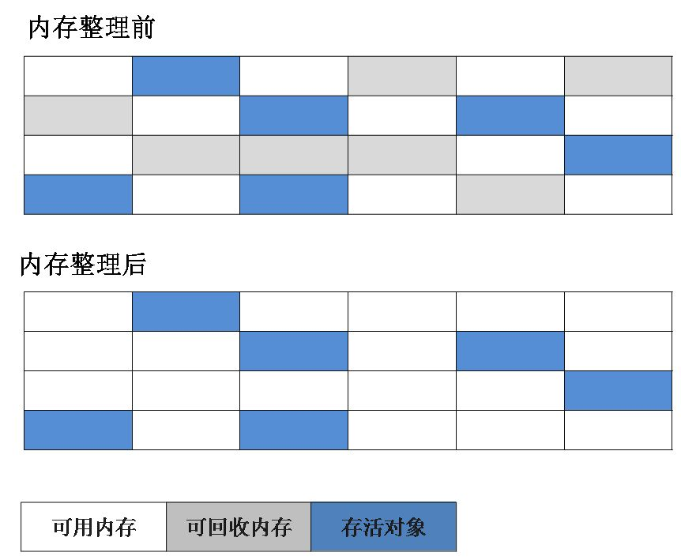
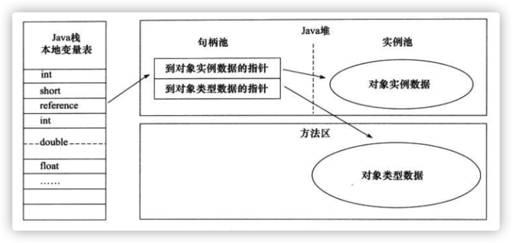

## JVM整理

[TOC]

### 一、JVM所在位置以及其体系结构

#### 1、位置

处于操作系统之上，相当于一个软件


#### 2、JVM的体系结构

(1) 指令集：JVM指令集
(2) 类加载器：在jvm启动时或者类在运行时将需要的class加载到JVM中
(3) 执行引擎：负责执行class文件中的字节码指令，相当于CPU
(4) 运行时数据区：将内存划分成若干个区，分别完成不同的任务
(5) 本地方法区：调用C或C++实现的本地方法代码返回的结果


### 二、类文件结构、类加载

#### 1、类文件结构

> 补充：语言无关性=>多种语言可以运行在Java虚拟机上
>
> 实现语言无关系的基础：虚拟机和.Class文件
>
> 

##### 1.1、Class类文件的结构

Class文件是一组以8个字节为基础单位的二进制流，各个数据项目严格按照顺序紧凑地排列在文件之中，中间没有添加任何分隔符，这使得整个Class文件中存储的内容几乎全部是程序运行的必要数据，没有空隙存在。当遇到需要占用8个字节以上空间的数据项时，则会按照高位在前的方式分割成若干个8个字节进行存储。

Class文件格式采用一种类似于C语言结构体的伪数据结构来存储数据，这种伪数据结构只有两种数据类型：”无符号数“和”表“

* **无符号数：**基本的数据类型，以u1、u2、u4、u8来分别代表1个字节、2个字节、4个字节和8个字节的无符号数，无符号数可以用来描述数字、索引引用、数量值或者按照utf-8编码构成字符串值。
* **表：**由多个无符号数或者其他表作为数据项构成的复合数据类型，为了便于区分，所有表的命名都习惯性地以”_info“结尾。表用于描述有层次关系的复合结构的数据，整个Class文件本质上也可以视作是一张表。

**Class文件格式如下：**


```xml
* 固定字段8个byte，与类本身并没有太大关系，每个class文件都有
* 常量池，长度不定，存储了各种常量
* 类信息，固定字段 3 * 2 byte，类访问标志、类索引、父类索引
* 接口，长度不定，存储了各个接口对应的索引
* 字段，长度不定，存储了各种字段
* 方法，长度不定，存储了各种方法
* 属性，长度不定，存储了各种属性
```

##### 1.2、魔数与Class文件的版本

* magic

  每个Class文件的头4个字节被称为魔数：作用Class文件的标志，他是一个固定的值OXCAFEBABY。如果开头四个字节不是OXCAFEBABY，那么就说明它不是Class文件，不能被识别

* minor_version和major_version

  次版本号和主版本号

##### 1.3、Class文件中的常量池概述

在Class文件中，位于版本号后面的就是常量池相关的数据项。

常量池是Class文件中内容最为丰富的区域之一。常量池对于Class文件中的字段和方法解析也有着至关重要的作用。

在版本号之后，紧跟着的是**常量池的数量**，以及**若干个常量池表项**。

常量池中常量的数量是不固定的，所以在常量池的入口需要放置一项u2类型的无符号数，代表常量池容量计数值（constant_pool_count）。与Java中语言习惯不一样的是，这个容量计数是从1而不是0开始的。

| 类型           | 名称                | 数量                    |
| -------------- | ------------------- | ----------------------- |
| u2（无符号数） | constant_pool_count | 1                       |
| cp_info（表）  | constant_pool       | constant_pool_count - 1 |

由上表可见，Class文件使用了一个前置的容量计数器（constant_pool_count）加若干个连续的数据项（constant_pool）的形式来描述常量池内容。我们把这一系列连续常量池数据称为常量池集合。

* 常量池表项中，用于存放编译时期生成的各种字面量和符号引用，这部分内容将在类加载后进入方法区的运行时常量池中存放

**字面量和符号引用**

| 常量     | 具体的常量          |
| -------- | ------------------- |
| 字面量   | 文本字符串          |
|          | 声明为funal的常量值 |
| 符号引用 | 类和接口的全限类名  |
|          | 字段的名称和描述符  |
|          | 方法的名称和描述符  |

> 补充：
>
> 虚拟机在加载Class文件时才会进行动态链接，也就是说，Class文件中不会保存各个方法和字段的最终内存布局信息。因此，这些字段和方法的符号引用不经过转换是无法直接被虚拟机使用的。当虚拟机运行时，需要从常量池中获得对应的符号引用，再在类加载过程中的解析阶段将其替换为直接引用，并翻译到具体的内存地址中。
>
> 符号引用和直接引用的区别与关联
>
> * 符号引用：符号引用以一组符号来描述引用的目标，符号可以是任意的字面量，只要使用时能无歧义地定位到目标即可。符号引用与虚拟机实现的内存布局无关，引用的目标并不一定已经加载到了内存中。
> * 直接引用：直接引用可以是直接指向目标的指针、相对偏移量或是一个能间接定位到目标的句柄。直接引用是与虚拟机实现的内存布局相关的，同一个符号引用在不同虚拟机实例上翻译出来的直接引用一般不会相同。如果有了直接引用，那说明引用的目标必定已经存在于内存之中了。

- 常量池：可以理解为Class文件之中的资源仓库，它是Class文件结构中与其他项目关联最多的数据类型（后面的很多数据类型都会指向此处），也是占用Class文件空间最大的数据项目之一。
- 常量池中为什么要包含这些内容？Java代码在进行Javac编译的时候，并不像C和C++那样有“连接”这一步骤，而是在虚拟机加载C1ass文件的时候进行动态链接。也就是说，在Class文件中不会保存各个方法、字段的最终内存布局信息，因此这些字段、方法的符号引用不经过运行期转换的话无法得到真正的内存入口地址，也就无法直接被虚拟机使用。当虚拟机运行时，需要从常量池获得对应的符号引用，再在类创建时或运行时解析、翻译到具体的内存地址之中。关于类的创建和动态链接的内容，在虚拟机类加载过程时再进行详细讲解

##### 1.4、访问标志

在常量池后，紧跟着访问标记。该标记使用两个字节表示，用于识别一些类或者接口层次的访问信息，包括：这个Class是类还是接口；是否定义为public类型；是否定义为abstract类型；如果是类的话，是否被声明为final等。各种访问标记如下所示：

| 标志名称       | 标志值 | 含义                                                         |
| -------------- | ------ | ------------------------------------------------------------ |
| ACC_PUBLIC     | 0x0001 | 标志为public类型                                             |
| ACC_FINAL      | 0x0010 | 标志被声明为final，只有类可以设置                            |
| ACC_SUPER      | 0x0020 | 标志允许使用invokespecial字节码指令的新语义，JDK1.0.2之后编译出来的类的这个标志默认为真。（使用增强的方法调用父类方法） |
| ACC_INTERFACE  | 0x0200 | 标志这是一个接口                                             |
| ACC_ABSTRACT   | 0x0400 | 是否为abstract类型，对于接口或者抽象类来说，次标志值为真，其他类型为假 |
| ACC_SYNTHETIC  | 0x1000 | 标志此类并非由用户代码产生（即：由编译器产生的类，没有源码对应） |
| ACC_ANNOTATION | 0x2000 | 标志这是一个注解                                             |
| ACC_ENUM       | 0x4000 | 标志这是一个枚举                                             |

类的访问权限通常为ACC_开头的常量。

每一种类型的表示都是通过设置访问标记的32位中的特定位来实现的。比如，若是public final的类，则该标记为ACC_PUBLIC | ACC_FINAL。

使用ACC_SUPER可以让类更准确地定位到父类的方法super.method()，现代编译器都会设置并且使用这个标记。

##### 1.5、类索引、父类索引、接口索引

在访问标记后，会指定该类的类别、父类类别以及实现的接口，格式如下：

| 长度 | 含义                         |
| ---- | ---------------------------- |
| u2   | this_class                   |
| u2   | super_class                  |
| u2   | interfaces_count             |
| u2   | interfaces[interfaces_count] |

这三项数据来确定这个类的继承关系：

- 类索引用于确定这个类的全限定名
- 父类索引用于确定这个类的父类的全限定名。由于Java语言不允许多重继承，所以父类索引只有一个，除了java.1ang.Object之外，所有的Java类都有父类，因此除了java.lang.Object外，所有Java类的父类索引都不为e。
- 接口索引集合就用来描述这个类实现了哪些接口，这些被实现的接口将按implements语句（如果这个类本身是一个接口，则应当是extends语句）后的接口顺序从左到右排列在接口索引集合中。

**...其他的结构详见课本**

#### 2、 类加载过程

当程序主动使用某个类的时候，如果类还未加载到内存中，则JVM会通过加载、连接、初始化3个步骤：


> 补：类的使用过程看
>
> 

##### 2.1 加载

​		加载指的是将类的class文件读入到内存，并为之创建一个java.lang.Class对象，也就是说，当程序中使用任何类时，系统都会为之建立一个java.lang.Class对象。该对象就是Java类在JVM内存中的一个快照，JVM将从字节码文件中解析出常量池、类字段、类方法等信息存储到类模板中，这样JVM在运行期间便能通过类模板而获取Java类中的任意信息，能够对Java类的成员变量进行遍历，也能进行Java方法的调用。**反射就的机制就是基于这个基础。如果JVM没有将Java类的信息存储起来，则JVM在运行期无法反射。**

* 系统加载器：JVM提供
* 继承ClassLoader类来创建自己的类加载器

> 补充：加载过程：
>
> * **通过类名，获取类的二进制数据流**
> * 解析类的二进制数据流为**方法区内的数据结构**（JVM类模型）
> * **创建java.lang.Class类实例**，表示该类型。作为方法区这个类的各种数据的访问入口
>
> 类将.class文件加载至元空间(JDK1.8之后)后，会在堆中创建一个Java.lang.Class对象，用来封装类位于方法区内的数据结构，该Class对象是在加载类的过程中创建的，每个类都对应有一个Class类型的对象。
>
> 


> 类加载器的数据来源
>
> 1. 本地文件系统加载class文件：绝大多数
> 2. 从jar包加载
> 3. 通过网络加载
> 4. 把一个Java源文件动态编译，并执行加载

##### 2.2 连接

​	当类被加载之后，系统会为之生成一个对应的Class对象，接着将会进入连接阶段，连接阶段负责把类的二进制数据合并到jre中。类的连接有分为三个阶段

**1）验证：确保加载的类信息符合JVM规范，例如：以cafe开头，没有安全方面的问题。**

验证的四部曲：


**2）准备：**类准备阶段负责为类的**静态变量分配内存**，并设置默认初始值。

> 补充：Java并不支持boolean类型，对于boolean类型，内部实现是int，由于int的默认值是0，故对应的，boolean的默认值就是false。
>
> 注意：
>
> ```java
> // 一般情况：static final修饰的基本数据类型、字符串类型字面量会在准备阶段赋值
> private static final String str = "Hello world";
> // 特殊情况：static final修饰的引用类型不会在准备阶段赋值，而是在初始化阶段赋值
> private static final String str = new String("Hello world");
> ```
>
> - 注意这里不会为实例变量分配初始化，类变量会分配在方法区中，而实例变量是会随着对象一起分配到Java堆中。

**3）解析：**将类的二进制数据中的符号引用替换成直接引用。

##### 2.3 初始化

​	初始化是为类的静态变量赋予正确的初始值，准备阶段和初始化阶段看似有点矛盾，其实是不矛盾的，如果类中有语句：private static int a = 10，它的执行过程是这样的，首先字节码文件被加载到内存后，先进行链接的验证这一步骤，验证通过后准备阶段，给a分配内存，因为变量a是static的，所以此时a等于int类型的默认初始值0，即a=0,然后到解析（后面在说），到初始化这一步骤时，才把a的真正的值10赋给a,此时a=10。

> 补充
>
> **最终结论**：使用static+final修饰，且显示赋值中不涉及到方法或构造器调用的基本数据类到或String类型的显式财值，是在链接阶段的准备环节进行。
>
> ```java
> public static final int INT_CONSTANT = 10;                                // 在链接阶段的准备环节赋值
> public static final int NUM1 = new Random().nextInt(10);                  // 在初始化阶段clinit>()中赋值
> public static int a = 1;                                                  // 在初始化阶段<clinit>()中赋值
> 
> public static final Integer INTEGER_CONSTANT1 = Integer.valueOf(100);     // 在初始化阶段<clinit>()中赋值
> public static Integer INTEGER_CONSTANT2 = Integer.valueOf(100);           // 在初始化阶段<clinit>()中概值
> 
> public static final String s0 = "helloworld0";                            // 在链接阶段的准备环节赋值
> public static final String s1 = new String("helloworld1");                // 在初始化阶段<clinit>()中赋值
> public static String s2 = "hellowrold2";                                  // 在初始化阶段<clinit>()中赋值
> ```

#### 3 、类加载时机

* 创建类的实例，new一个对象的时候
* 调用某个类或接口的静态变量，或者对该静态变量进行初始化
* 调用类的静态方法
* 反射（Class.forName("com....")）
* 初始化一个类的子类
* JVM启动时标明的启动类

**注：**

 对于一个final类型的静态变量，如果该变量的值在编译时就可以确定下来，那么这个变量相当于“宏变量”。Java编译器会在编译时直接把这个变量出现的地方替换成它的值，因此即使程序使用该静态变量，也不会导致该类的初始化。反之，如果final类型的静态Field的值不能在编译时确定下来，则必须等到运行时才可以确定该变量的值，如果通过该类来访问它的静态变量，则会导致该类被初始化。

> 补：
>
> * 类、类的加载器、类的实例之间的引用关系
>
>   * 在类加载器的内部实现中，用一个Java集合来存放所加载类的引用；另一方面，一个Class对象总是会引用它的类加载器，调用Class对象的getClassLoader()方法，就能获得它的类加载器。由此可见，代表**某个类的Class实例与其类的加载器之间为双向关联关系。**
>   * 一个类的实例总是引用代表这个类的Class对象。在Object类中定义了getClass()方法，这个方法返回代表对象所属类的Class对象的引用。此外，所有的java类都有一个静态属性class，它引用代表这个类的Class对象。
>
> * 类的生命周期
>
>   当Sample类被加载、链接和初始化后，它的生命周期就开始了。当代表Sample类的Class对象不再被引用，即不可触及时，Class对象就会结束生命周期，Sample类在方法区内的数据也会被卸载，从而结束Sample类的生命周期。
>
>   

#### 4、 类加载器

> 补：类加载器的作用：
>
> ClassLoader负责通过各种方式将Class信息的二进制数据流读入JVM内部，转换为一个与目标类对应的java.lang.Class对象实例。然后交给Java虚拟机进行链接、初始化等操作。因此，**ClassLoader在整个装载阶段，只能影响到类的加载，而无法通过ClassLoader去改变类的链接和初始化行为。至于它是否可以运行，则由Execution Engine决定。**
>
> 面试题：补充 Class.forName()和ClassLoader.loadClass 对比？
>
> Class.forName(className)方法，内部实际调用的方法是Class.forName(className,true,classloader); =>默认是需要初始化的
>
> ClassLoader.loadClass(className)，方法，内部实际调用的方法是 ClassLoader.loadClass(className,false);=>默认不进行链接，**不进行链接意味着不进行包括初始化等一些列步骤，那么静态块和静态对象就不会得到执行**


**类加载的分类：显式加载、隐式加载**

```java
//隐式加载
User user=new User();
//显式加载，并初始化
Class clazz=Class.forName("com.test.java.User");
//显式加载，但不初始化
ClassLoader.getSystemClassLoader().loadClass("com.test.java.Parent"); 
```


三个重要的`ClassLoader`，除了 `BootstrapClassLoader` 其他类加载器均由 Java 实现且全部继承自`java.lang.ClassLoader`：

* **BootstapClassLoader（启动类加载器）**：最顶层的加载器，由C++实现，负责加载 `%JAVA_HOME%/lib`目录下的jar包和类或者或被 `-Xbootclasspath`参数指定的路径中的所有类。
* **ExtensionClassLoader(扩展类加载器)** ：主要负责加载目录 `%JRE_HOME%/lib/ext` 目录下的jar包和类，或被 `java.ext.dirs` 系统变量所指定的路径下的jar包。
* **AppClassLoader(应用程序类加载器)** :面向我们用户的加载器，负责加载当前应用classpath下的所有jar包和类。


#### 5、 类加载机制

##### 5.1、类加载机制的基本特征

双亲委派模型不是所有类加载都遵循这个模型，有的时候，启动类加载器所加载的类型，是可能要加载用户代码的，比如JDK内部的ServiceProvider/ServiceLoader机制，用户可以在标准API框架上，提供自己的实现，JDK也需要提供些默认的参考实现。

**可见性：**子类加载器可以访问父类加载器，但是父类加载器不能访问子类加载器。

**单一性：**由于父加载器的类型对于子加载器是可见的，所以父加载器中加载过的类型，就不会在子加载器中重复加载。


##### 5.2、双亲委派机制

​		加载的时候，**首先会把该请求委派该父类加载器**的 `loadClass()` 处理，因此所有的请求最终都应该传送到顶层的启动类加载器 `BootstrapClassLoader` 中。**当父类加载器无法处理时，才由自己来处理。**当父类加载器为null时，会使用启动类加载器 `BootstrapClassLoader` 作为父类加载器。


##### 双亲委派的模型的好处？

* 可以避免类的重复加载（JVM 区分不同类的方式不仅仅根据类名，相同的类文件被不同的类加载器加载产生的是两个不同的类）
* 保证了 Java 的核心 API 不被篡改。

##### 如何打破双亲委派模型？

​		自定义加载器的话，需要继承 `ClassLoader` 。如果我们不想打破双亲委派模型，就重写 `ClassLoader` 类中的 `findClass()` 方法即可，无法被父类加载器加载的类最终会通过这个方法被加载。但是，如果想打破双亲委派模型则需要重写 `loadClass()` 方法。

### 三、Native

凡是带了native关键字的，就说明Java的作用范围达不到了，会去调用底层C语言的库

>  Java在内存区域中专门开辟了一块标记区域——本地方法栈，用来登记native方法，凡是带了native关键字的，会进入到本地方法栈中，调用本地方法接口（JNI），在最终执行的时候，加载本地方法库中的方法通过JNI


* JNI的作用：扩展Java的使用，融合不同的编程语言为Java所用，不过最初是想融合C，C++的，因为Java诞生的时候，C，C++横行，想要立足的话就要有能调用C的程序
* 本地方法栈：具体做法是，在Native Method Stack中登记native方法，在执行引擎执行的时候加载Native Libraies【本地库】

### 四、PC程序计数器（JVM内存中唯一不会出现OOM的地方）

​		每个线程都有一个程序计数器， 是**线程私有**的，类似一个指针， 指向方法区中的方法字节码(用来存储指向一条指令的地址， 也即将要执行的指令代码)，在执行引擎读取下一条指令, 是一个非常小的内存空间，几乎可以忽略不计。

> 如果线程正在执行的是一个Java方法，这个计数器记录的是正在执行的虚拟机字节码指令的地址
>
> 如果正在执行的是一个本地方法，这个计数器的值应该为空（undifined）

### 五、栈（Java虚拟机栈、本地方法栈）

#### 1、栈（什么是栈）

##### 1.1 栈里面存放了什么？

8大基本类型+对象的引用+实例的方法

##### 1.2 栈运行原理

栈帧：


##### 1.3、栈堆方法的交互关系


#### 2、Java虚拟机栈

​		与程序计数器一样，Java虚拟机栈也是**线程私有**的，它的生命周期和线程相同，描述的是 Java 方法执行的内存模型，每次方法调用的数据都是通过栈传递的。

Java虚拟机栈会出现的两种错误：`StackoverFlowError`和`OOM`

- **`StackOverFlowError`：** **若 Java 虚拟机栈的内存大小不允许动态扩展，**那么当线程请求栈的深度超过当前 Java 虚拟机栈的最大深度的时候，就抛出 `StackOverFlowError `错误。
- **`OutOfMemoryError`：** **Java 虚拟机栈的内存大小可以动态扩展，** 如果虚拟机在动态扩展栈时无法申请到足够的内存空间，则抛出`OutOfMemoryError`异常异常。

> 补充：虚拟机栈描述的是Java方法执行的线程内存模型：每个方法被执行的时候，Java虚拟机都会同步创建一个栈帧用于存储局部变量表、操作数栈、动态连接、方法出口等信息。每个方法被调用直至执行完毕的过程，就对应着一个栈帧在虚拟机栈中入栈到出栈的过程。

#### 3、本地方法栈

​		和虚拟机栈所发挥的作用非常相似，区别是： **虚拟机栈为虚拟机执行 Java 方法 （也就是字节码）服务，而本地方法栈则为虚拟机使用到的 Native 方法服务。**

​		也会出现`StackOverFlowError `和OOM

### 六、方法区

​		方法区与 Java 堆一样，是各个**线程共享的内存区域**，它用于存储已被虚拟机加载的类信息、常量、静态变量、即时编译器编译后的代码等数据。虽然 **Java 虚拟机规范把方法区描述为堆的一个逻辑部分**，但是它却有一个别名叫做 **Non-Heap（非堆）**，目的应该是与 Java 堆区分开来。

* 方法区和永久代的关系

> 《Java 虚拟机规范》只是规定了有方法区这么个概念和它的作用，并没有规定如何去实现它。那么，在不同的 JVM 上方法区的实现肯定是不同的了。 **方法区和永久代的关系很像 Java 中接口和类的关系，类实现了接口，而永久代就是 HotSpot 虚拟机对虚拟机规范中方法区的一种实现方式。** 也就是说，永久代是 HotSpot 的概念，方法区是 Java 虚拟机规范中的定义，是一种规范，而永久代是一种实现，一个是标准一个是实现，其他的虚拟机实现并没有永久代这一说法。


### 七、堆

**`JVM`内存中最大的一块，大小可以调节，GC的主要区域**

#### 1、堆里面存放了什么：

对象实例，数组等

#### 2、堆的分区

* 新生区 young/new
* 养老区 old
* 永久区 perm：JDK1.8之后称为元空间

**注：垃圾回收主要在伊甸园区和养老区**


##### 2.1 新生区

> 注意：HotSpot默认Eden区和Survivor区的大小是8：1：1，每次新生代中可用内存空间为整个新生代的90%，发生垃圾回收的时候，将Eden和Survivor 0 区存活的对象，一次性复制到另外一块Survivor 1区空间上。

**类诞生和成长的地方，甚至死亡**

新生区又可以分为：伊甸园区、幸存0区、幸存1区


##### 2.2 养老区

新生区没干掉，没杀死的来到了养老区~

##### 2.3 永久区

> JDK 8 版本之后方法区（HotSpot 的永久代）被彻底移除了（JDK1.7 就已经开始了），取而代之是元空间，元空间使用的是直接内存。


但是，元空间：逻辑上存在，物理上不存在

#### 3、出现OOM

* 尝试扩大堆内存去查看内存结果

  `-Xms1024m -Xmx1024m -XX:+PrintGCDetails`

* 若不行，分析内存，看一下是哪个地方出现了问题（专业工具）

#### 4、基本调优参数

> -Xms	设置初始化内存分配大小，默认1/64

> -Xmx	设置最大分配内存，默认1/4

> -XX:+PrintGCDetails	打印GC垃圾回收信息

> -XX:+HeapDumpOnOutOfMemoryError	生成oomDump文件

> ``-Xms1m -Xmx8m -XX:+HeapDumpOnOutOfMemoryError``

> `-Xms1024m -Xmx1024m -XX:+PrintGCDetails`

### 八、GC（垃圾回收）

#### 1、垃圾回收作用区域


JVM在进行GC时，并不是对这三个区域统一回收，大部分时候，回收都是新生代

- 新生代
- 幸存区（form to）【会交换的，不是一成不变的】
- 老年区

GC两种类型：轻GC（普通的GC），重GC（全局GC）

#### 2、常见的面试题

- **如何判断对象是否死亡（两种方法）。**

  

  * 引用计数法：每当有一个地方引用它。计数器就加 1；当引用失效，计数器就减 1；任何时候计数器为 0 的对象就是不可能再被使

  * 用的。

    * 优点：简单，效率高
    * 缺点：**难解决对象之间相互循环引用的问题**

  * 可达性分析算法

    这个算法的基本思想就是通过一系列的称为 **“GC Roots”** 的对象作为起点，从这些节点开始向下搜索，节点所走过的路径称为引用链，当一个对象到 GC Roots 没有任何引用链相连的话，则证明此对象是不可用的。

    

    GC Roots包含哪些？

    * 虚拟机栈（栈帧中的本地变量表）中引用的对象。譬如各个线程被调用的方法堆栈中使用到的参数、局部变量、临时变量等
    * 本地方法栈中的JNI（通常说的Native方法）引用的对象
    * 在方法区中类静态属性引用的对象，譬如Java类的引用类型静态变量
    * 在方法区中常量引用的对象，譬如字符串常量池里的引用
    * Java虚拟机内部的引用，如基本数据类型对应的Class对象，一些常驻的异常对象（NullPointException，OutOfMemaryError）等，还有系统类加载器等

    > 注意：一个对象是生存还是死亡？即使在可达性分析的算法判定为不可达对象，也不是"非死不可的"
    >
    > 正在宣告一个对象死亡至少要经历两次标记过程：
    >
    > * 在进行可达性分析后判断不可达标记一次
    > * finalize()执行后，进入F-Queue的队列中，此时如果该对象再重新与GC Roots上的对象简历关联，就会被移出“即将挥手的集合”，如果这个对象没有逃脱就真的要被回收了。（注：一个对象发finalized()方法只会执行一次：例子：书本73页）

- **简单的介绍一下强引用、软引用、弱引用、虚引用（虚引用与软引用和弱引用的区别、使用软引用能带来的好处）。**

  - **强引用：**如果一个对象具有强引用，垃圾回收器绝不会回收它。当**内存空间**不足，Java 虚拟机宁愿抛出 OOM 错误，使程序异常终止，也不会靠随意回收具有强引用的对象来解决内存不足问题。
  - **软引用：**如果一个对象只具有软引用，如果**内存空间**足够，垃圾回收器就不会回收它，如果内存空间不足了，就会回收这些对象的内存。
  - **弱引用：**弱引用与软引用的区别在于：**只具有弱引用的对象拥有更短暂的生命周期**。在垃圾回收器线程扫描它所管辖的内存区域的过程中，一旦发现了只具有弱引用的对象，**不管当前内存空间**足够与否，都会回收它的内存。
  - **虚引用：**"虚引用"顾名思义，就是形同虚设，与其他几种引用都不同，虚引用**并不会决定对象的生命周期**。如果一个对象仅持有虚引用，那么它就和没有任何引用一样，在任何时候都可能被垃圾回收。

  **软引用可以加速 JVM 对垃圾内存的回收速度，可以维护系统的运行安全，防止内存溢出（OutOfMemory）等问题的产生**。

- **方法区的垃圾回收**

  - 废弃常量的回收
  - 不再使用的类型（无用的类）

- **如何判断一个常量是废弃常量**

  假如在字符串常量池中存在字符串 "abc"，如果当前没有任何 String 对象引用该字符串常量的话，就说明常量 "abc" 就是废弃常量，如果这时发生内存回收的话而且有必要的话，"abc" 就会被系统清理出常量池了。

- **如何判断一个类是无用的类**

  - 该类所有的实例都已经被回收，也就是 Java 堆中不存在该类的任何实例。
  - 加载该类的 `ClassLoader` 已经被回收。
  - 该类对应的 `java.lang.Class` 对象没有在任何地方被引用，无法在任何地方通过反射访问该类的方法。

  虚拟机可以对满足上述 3 个条件的无用类进行回收，这里说的仅仅是“可以”，而并不是和对象一样不使用了就会必然被回收。

- **垃圾收集有哪些算法，各自的特点？**

- **HotSpot 为什么要分为新生代和老年代？**

  对象的存活时间和所占用的内存大小不一样，根据这些不同点，堆内存有分配策略，比如对象优先分配在新生区，大对象直接进入老年区，长期存活的对象也会进入老年区。这样是为了更好的进行垃圾回收。分代GC

- 常见的垃圾回收器有哪些？

- 介绍一下 CMS,G1 收集器。

- Minor Gc 和 Full GC 有什么不同呢？

  - 部分收集 (Partial GC)：
    - 新生代收集（Minor GC / Young GC）：只对新生代进行垃圾收集；
    - 老年代收集（Major GC / Old GC）：只对老年代进行垃圾收集。需要注意的是 Major GC 在有的语境中也用于指代整堆收集；
    - 混合收集（Mixed GC）：对整个新生代和部分老年代进行垃圾收集。
  - 整堆收集 (Full GC)：收集整个 Java 堆和方法区。

#### 3、堆内存常见的分配策略


> 补：
>
> 1. 大多数情况下，对象在新生代Eden区进行分配。当Eden区没有足够空间进行分配时，虚拟机将发起一次Minor GC
>
> 2. 大对象直接进入老年代
>
> 3. 长期存活的对象将直接进入老年代
>
>    每个对象有一个年龄计数器，放在对象头中。对象通常在eden区诞生，第一次Minor GC时，如果对象没被回收，并且到survivor区，记为1岁。以后每次MinorGC没被回收，年龄+1。加到晋升阈值（默认15）就会被分配到老年代。

#### 4、垃圾回收算法


##### 4.1 标记清除法

该算法分为“标记”和“清除”阶段：**首先标记出所有不需要回收的对象，在标记完成后统一回收掉所有没有被标记的对象。**

存在问题：

* 效率问题：执行效率不稳定，如果Java堆中包含大量对象，而且其中大部分是需要被回收的，这时必须进行大量标记和清除动作，导致标记和清除两个过程的执行效率都随对象数量的增长而降低。
* 空间问题：会有内存碎片，会导致当以后需要分配大对象时无法找到足够的连续内存空间而不得不提前触发另一次垃圾收集动作。



##### 4.2 标记-复制法

为了解决效率问题，“标记-复制”收集算法出现了。**它可以将内存分为大小相同的两块**，每次使用其中的一块。**当这一块的内存使用完后，就将还存活的对象复制到另一块去，然后再把使用的空间一次清理掉。**这样就使每次的内存回收都是对内存区间的一半进行回收。

缺点：

这种复制算法的代价是将可用内存缩小为原来的一半，空间浪费的多。


##### 4.3 标记整理法

根据老年代的特点提出的一种标记算法，标记过程仍然与“标记-清除”算法一样，但后续步骤不是直接对可回收对象回收，而是让所有存活的对象向一端移动，然后直接清理掉端边界以外的内存。

>补充：移动和不移动的坏处
>
>移动：在老年代这种每次回收都有大量对象存活的区域，移动存活对象并更新所有引用这些对象的地方将会是一种极为负重的操作。
>
>不移动：弥撒于堆中的存活对象导致内存空间的碎片化问题就只能依赖更为复杂的内存分配器和内存访问器来解决。
>
>在垃圾收集的停顿时间来看，不移动的时间更短，甚至不需要停顿。从吞吐量上看移动的吞吐量高


##### 4.4 分代收集法

* 新生代：标记复制
* 老年代：标记清除，标记整理

#### 5、常见的垃圾回收器

> 七款经典收集器与垃圾分代之间的关系


> 垃圾回收器的组合关系


##### 5.1、Serial 收集器、Serial Old收集器

* 线程类型：单线程，会使用一条垃圾收集进程去完成垃圾收集工作
* 是否暂停其他线程：是,"stop-the-World"机制
* 适用：作为HotSpot中Client模式下默生代垃圾收集器
* 垃圾回收算法：新生代：标记-复制算法，老年代：标记整理算法
* Serial Old 收集器：作为HotSpot中Client模式下老年代垃圾收集器


##### 5.2、ParNew 收集器（并行回收）

* 线程类型：多线程，其实就是Serial收集器的多线程版本，除了使用多线程进行垃圾收集外，其余行为（控制参数、收集算法、回收策略等等）和Serial收集器完全一样
* 是否暂停其它线程：是,"stop-the-World"机制
* 适用：作为HotSpot中Server模式下默新生代垃圾收集器
* 垃圾回收算法：新生代（并行）：标记复制法、老年代（串行）：标记整理法


##### 5.3、Parallel Scavenge 收集器（吞吐量优先）java8中默认

>  Parallel和Parallel old

* Parallel Scavenge收集器同时也采用了复制算法、并行回收和、“stop the world”机制。
  * 和ParNew收集器不同，Parallel Scavenge收集器的目标是达到一个可控制的吞吐量，它也称为吞吐量优先的垃圾收集器
  * 自适应调节策略也是Parallel Scavenge与ParNew一个重要区别
* 适用：常见在服务器环境中使用
* 垃圾回收算法：新生代（并行）：标记复制法、老年代（串行）：标记整理法


##### 5.4、CMS 收集器：低延迟

* CMS收集器的关注点是尽可能的缩短垃圾收集时用户线程的停顿时间，停顿时间越短（低延迟）就越适合与用于交互的程序，良好的响应速度能提升用户体验
* CMS的垃圾收集算法采用**标记一清除算法**，并且也会**" stop一the一world"**
  * 为啥使用标记清除法：如果用标记整理法的话，原来的用户使用的内存会被影响。
* 只能与新生代收集器里面的**ParNew**或者**Serial**一起使用

> CMS执行过程


主要分为z四个阶段（初始标记->并发标记->重新标记->并发清理）

* **初始标记阶段：**该阶段会暂停其他用户线程，但是主要标记GCRoot直接相关的对象，速度特别快。
* **并发标记阶段：**从GCRoot直接关联对象开始遍历整个对象图的过程，这个过程比较长但是不需要暂停其它用户线程，可以与其他线程一起并发执行
* **重新标记阶段：**该阶段会暂停其他用户线程，在并发标记的过程中，程序的工作线程和垃圾回收线程同时运行或者交叉运行，为了去修正并发标记期间，用户程序运行导致标记发送变化的那些对象。
* **并发清理阶段：**删除掉标记阶段判断为垃圾的对象，释放内存。

注：堆内存使用率达到某一阈值时，CMS就会开始回收：原因时垃圾收集阶段用户线程没用中断，多以应该确保用户想吃有足够的内存可用。当达到阈值的时候：就会临时启用Serial old收集器来重新进行老年代的垃圾回收，这样停顿时间就很长了

**缺点：**

* **CMS收集器对处理器资源非常敏感**，在并发阶段，它虽然不会导致用户线程停顿，但却会因为占用了一部分线程而导致引用程序变慢，降低吞吐量。**CMS默认启动的回收线程数是（处理器数量+3）/ 4 （向下取整）**，也就是说，如果处理器核心数在四个或者以上，并发时垃圾回收线程只占不超过25%的CPU资源，但是当核心处理器**小于4个的时候，CMS对用户程序的影响就很大**。之后提出了"**增量式CMS**"，就是**思想和操作系统的”抢占式多任务“类似**，在并发标记和清理的时候让垃圾收集线程、用户现场交替执行，尽量的减少垃圾线程的独占资源的时间。
* **无法处理浮动垃圾**（浮动垃圾就是标记完成之后产生的垃圾，比如并发清理的时候是和用户程序一起执行的，此时用户程序会产生垃圾，这个就是浮动垃圾）。由于浮动垃圾，所以CMS不能像其它垃圾回收器一样当老年代几乎完全填满的时候才启动垃圾回收。
*  **标记清除法产生的内存碎片**

##### 5.5、G1收集器（区域化分代式）

* **面向服务端应用**的垃圾收集器，针对配备多核GPU及大容量内存的机器，以极高的概率满足GC停顿时间的同时，改兼具高吞吐量的性能特征，主要提出了分区Region=>跨代引用、可靠的停顿预测模型=>垃圾收集过程=>在并发标记阶段如何保证收集线程与用户线程互不干扰地运行。

---

> **补充：分区Region：化整为零**
>
> * G1将整个Java堆分成约2048个大小相同的独立的Region块，所有Region的大小相同。
>
>   
>
> * 一个region 有可能属于Eden， Survivor 或者Old/Tenured 内存区域。但是一个region只可能属于一个角色。
>
> * 多了Humongous内存区，用来存放大对象（超过1.5个Region）

---

---

>补充：跨代引用的问题（Young GC）
>
>一个对象被不同区域引用的问题:一个Region不可能是孤立的，一个Region中的对象可能被其他任意Region中对象引用，判断对象存活时，是否需要扫描整个Java堆才能保证准确？
>
>* 每个Region都有一个相应的Remember Set。
>* 每个Reference类型数据写操作的时候。都会产生一个Write Barrier暂时中断操作
>* 检查将要写入的引用的对象是否和该reference类型数据在不同的Region
>* 如果不同，通过cardTable把相关引用信息记录到引用指向对象的所在Region对应的Remember Set中
>* 当进行垃圾收集时，在GC根节点的枚举范围加入Remember Set：可以保证不进行全局扫描，也不会有遗漏。
>
>

---

**G1垃圾回收器的回收过程**

> 注：SATB：原始快照算法 =>  GC开始之前对堆内存对象的一次快照，标记存活对象，从而开成一个对象图。
>
> TAMS指针：G1为每个Region都设计了两个名为TAMS的指针，把Region中一部分空间划分出来用于并发回收过程中的新对象分配

* **初始标记：**仅仅标记一下GC Roots能直接关联到对象，并且修改TAMS指针的值，让下一阶段用户线程并发运行时，能正确地在可用的Region中分配新的对象
* **并发标记：**从GC Roots开始对堆中的对象进行可达性分析，递归扫描整个堆里的对象图，找出要回收的对象，这个阶段耗时间长，可与用户程序并发执行。当对象图扫描完成之后，还要重新处理SATB记录下的在并发是有引用变动的对象。
* **最终标记：**对用户线程做另一个短暂的暂停，用于处理并发阶段结束后仍遗留下来的最后那少量的SATB记录。
* **筛选回收（暂停用户线程）：**负责更新Region统计数据，对各个Region的回收价值和成本进行排序，根据用户所期望的停顿时间（推荐设置为一两百毫秒，或者两三百毫秒）来制定回收计划，可以自由选择任意多个Region构成回收集，然后把确定回收的那一部分Region的存活对象复制到空Region中，再清理掉整个旧Region的全部空间


* **优点/与CMS比较**：与其他GC收集器相比，G1使用了全新的分区算法
  * 并行与并发
    * 并行性：G1在回收期间，可以有多个GC线程同时工作，此时用户线程STW
    * 并发性：G1拥有与应用程序交替执行的能力，部分工作可以和应用程序同时执行，因此，一般来说，不会在整个回收阶段发生完全阻塞应用程序的情况
  * 分代收集
  * 空间整合：将内存划分成一个个的region。内存的回收时以region作为基本单位的。region之间是复制算法，但整体上看作是标记-压缩算法，可以避免内存碎片
  * 可预测的停顿时间模型
    * G1之所以可以建立起可预测的停顿时间模型，是因为它将Region作为单次回收的最小单元，即每次收集到的内存空间都是Region大小的整数倍，这样可以有计划地避免在整个Java堆中进行全区域的垃圾收集。更具体的思路是让G1收集器去追踪各个Region里面的垃圾堆的”价值“大小，价值就是回收获得的空间大小以及回收所需要时间的经验值，在后台维护一个优先级列表，每次根据用户设定允许的收集停顿时间，有限处理回收价值更大的那些Region。
* 缺点：
  * 相较于CMS，G1还不具备全方位，压倒性的优势。在程序运行过程中，G1在内存占用和执行负载都要比CMS高
  * 在小内存应用上CMS的表现大概率会优于G1，而G1在大内存应用上则发挥其优势。平衡点在6-8GB之间

**垃圾回收器的总结**


**可能的面试题？**

并发标记阶段如何保证收集线程与用户线程互不干扰地运行？

原始快照算法+TAMS标记

### 九、对象的创建过程


#### 1、类加载检查

​		虚拟机遇到一条 new 指令时，首先将去检查这个指令的参数是否能在**常量池**中**定位到这个类的符号引用**，并且检查这个符号引用代表的类是否已被**加载过、解析和初始化过**。如果没有，那必须先执行相应的类加载过程。

#### 2、分配内存

**内存分配的两种方式：**

* 指针碰撞
* 空闲列表


>  **分配内存的时候出现的线程不安全问题：（对象A分配内存，指针还没来得及修改，对象B又同时使用原来的指针来分配内存的情况）**
>
> 解决的两种可选方案：
>
> * 采用CAS配上失败重试的方式保证更新操作的原子性
> * 把内存分配的动作按照线程划分在不同的空间进行，即每个线程在Java堆中预分配一小块内存，称为本地线程分配缓冲，哪个线程要分配内存，就在哪个线程的本地缓冲区中分配，只有本地缓冲区用完了，分配新的缓存区才需要同步锁定。

#### 3、初始化零值

内存分配完成后，虚拟机需要将分配到的内存空间都初始化为零值（不包括对象头）**，这一步操作保证了对象的实例字段在 Java 代码中可以不赋初始值就直接使用，**程序能访问到这些字段的数据类型所对应的零值。

#### 4、设置对象头

初始化零值完成之后，**虚拟机要对对象进行必要的设置**，例如这个对象是哪个类的实例、如何才能找到类的元数据信息、对象的哈希码、对象的 GC 分代年龄等信息。 **这些信息存放在对象头中。** 另外，根据虚拟机当前运行状态的不同，如是否启用偏向锁等，对象头会有不同的设置方式。

#### 5、执行init方法

在上面工作都完成之后，从虚拟机的视角来看，一个新的对象已经产生了，但从 Java 程序的视角来看，对象创建才刚开始，`<init>` 方法还没有执行，所有的字段都还为零。所以一般来说，执行 new 指令之后会接着执行 `<init>` 方法，把对象按照程序员的意愿进行初始化，这样一个真正可用的对象才算完全产生出来。

### 十、对象的内存布局

分为3个区域

* 对象头：

  **第一部分用于存储对象自身的运行时数据**（哈希码、GC 分代年龄、锁状态标志等等），

  **另一部分是类型指针**，即对象指向它的类元数据的指针，虚拟机通过这个指针来确定这个对象是那个类的实例。

* 实例数据

  **实例数据部分是对象真正存储的有效信息**，也是在程序中所定义的各种类型的字段内容。

* 对齐填充

  **对齐填充部分不是必然存在的，也没有什么特别的含义，仅仅起占位作用**

  
### 十一、对象的访问定位

* 使用句柄
* 直接指针

**句柄：**

 如果使用句柄的话，那么 **Java 堆中将会划分出一块内存来作为句柄池，**reference 中存储的就是对象的句柄地址，而句柄中包含了对象实例数据与类型数据各自的具体地址信息；



**直接指针：**

如果使用直接指针访问，那么 Java 堆对象的布局中就必须考虑如何放置访问类型数据的相关信息，而 reference 中存储的直接就是对象的地址


**这两种对象访问方式各有优势。使用句柄来访问的最大好处是 reference 中存储的是稳定的句柄地址，在对象被移动时只会改变句柄中的实例数据指针，而 reference 本身不需要修改。使用直接指针访问方式最大的好处就是速度快，它节省了一次指针定位的时间开销。**

### 十二、补充：HotSpot的算法细节实现

#### 1、根节点枚举（GC Roots）

在可达性分析算法中：GC Roots的查找引用链的这个操作叫做根节点枚举

使用一组称为OopMap的数据结构直接得到哪些地方存放对象的引用的

一旦类加载动作完成的时候，HotSpot就会把对象内什么偏移量上是什么类型的数据计算出来，在即时编译的过程中，也会在特定的位置记录下栈里和寄存器里哪些位置是引用。


可以看到在0x026eb7a9处的call指令有OopMap记录，它指明了EBX寄存器和栈中偏移量为16的内存区域各有一个普通对象指针（OOP）的引用，有效范围为从call指令开始直到0x026eb730（指令流开始位置）+142（Oop记录的偏移量）=0x026eb7be（hlt指令）为止

#### 2、安全点

实际上HotSpot没有明确为每条指令都生成OopMap，前面已经提到，只是在“特定的位置”记录了这些信息，这些位置被称为安全点。程序执行时并非在代码指令流的任意位置都能停顿下来开始来及收集，而是要求必须执行到安全点后才能暂停。

安全点位置的选取：

* 方法调用
* 循环跳转
* 异常跳转

如何让垃圾收集发生的时候让所有线程都跑到最近的安全点，然后停顿下来。

* 抢先式中断

  在垃圾收集发生时，系统首先把所有用户线程全部中断，如果发现有用户线程中断的地方不在安全点上，就恢复这条线程执行，让它一会儿再重新中断，直到跑到安全点上。现在几乎没有虚拟机实现采用抢占式中断来暂停线程响应GC事件。

* 主动式中断

  当垃圾收集需要中断线程的时候，不直接对线程操作，仅仅简单设置一个标志位，各个线程执行过程时会不停地主动去轮询这个标志，一旦发现中断标志为真时就自己在最近的安全点上主动中断挂起。

#### 3、安全区域

安全区域时指能够在某一段代码片段之中，引用关系不会发生变化，因此，在这个区域中任意地方开始垃圾收集都是安全的。我们也可以把安全区域看作被扩展拉伸的安全点

当用户线程执行到安全区域里面的代码的时候，首先会标识自己已经进入了安全区域，那样当这段时间里虚拟机要发起垃圾收集时就不必去管这些已经声明在安全区域内的线程了。当线程要离开安全区域时，它要检查虚拟机是否已经完成了根节点枚举，如果完成了，那线程就当没事发生过，继续执行，否则就一直等待，直到收到可以离开安全区域的信号为止。

#### 4、记忆集和卡表

记忆集是一种用于记录从非收集区域指向收集区域的指针集合的抽象数据结构

卡表是记忆集的一种实现


字节数组Card Table的每一个元素对应着其标识的内存区域中的一个内存块（卡页）。一个卡页的内存中通常包含不止一个对象，只要卡页有一个（或多个）对象的字段存在跨代指针，那就将对应卡表的数组元素的值标识置为1，称这个元素变脏，没有则标记为0。在垃圾回收发生的时候只要筛选出卡表中变脏的元素，就能轻易得出哪些卡页内存块中包含跨代指针，把他们加入到GC Roots中一并扫描。

#### 5、写屏障（用来维护卡表元素）

**写屏障：**可以看作在虚拟机层面对“引用类型字段赋值”这个动作的AOP切面，在引用对象类型赋值时会产生一个环形通知，供程序指向额外的动作。赋值前：写前屏障、赋值后：写后屏障

* 在应用了写屏障后，虚拟机就会为所有赋值操作生成相应的指令，一旦收集器在写屏障中增加了对卡表的操作，无论更新的是不是老年代对新生代对象的引用，都会有额外的开销。但是这个开销与Minor GC是扫描整个老年代的代价相比低很多。

**读屏障：**内存屏障，在volatile中提到


