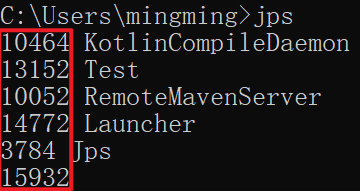
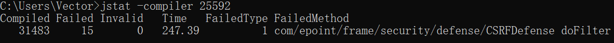
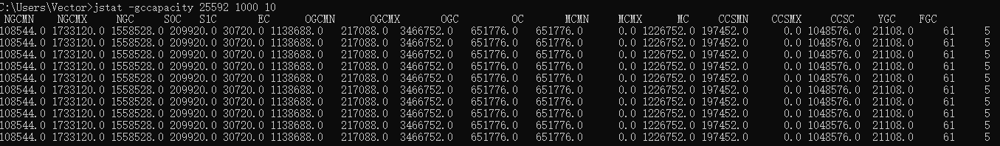
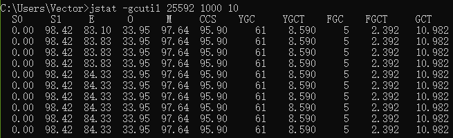
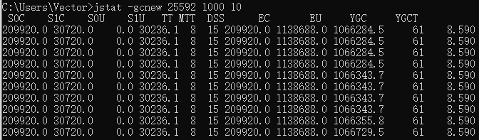
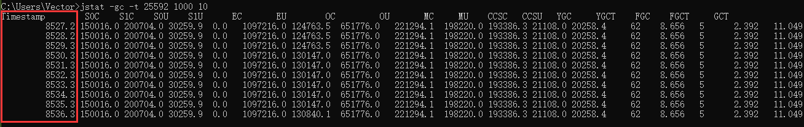
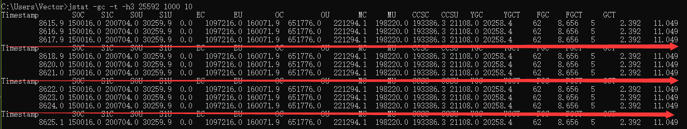

## JVM调优

### 一、概述

#### 1.1、大厂面试题

```bash
支付宝：

支付宝三面：JVM性能调优都做了什么？

小米：

有做过JVM内存优化吗？

从SQL、JVM、架构、数据库四个方面讲讲优化思路

蚂蚁金服：

JVM的编译优化

jvm性能调优都做了什么

JVM诊断调优工具用过哪些？

二面：jvm怎样调优，堆内存、栈空间设置多少合适

三面：JVM相关的分析工具使用过的有哪些？具体的性能调优步骤如何

阿里：

如何进行JVM调优？有哪些方法？

如何理解内存泄漏问题？有哪些情况会导致内存泄漏？如何解决？

字节跳动：

三面：JVM如何调优、参数怎么调？

拼多多：

从SQL、JVM、架构、数据库四个方面讲讲优化思路

京东：

JVM诊断调优工具用过哪些？

每秒几十万并发的秒杀系统为什么会频繁发生GC？

日均百万级交易系统如何优化JVM？

线上生产系统OOM如何监控及定位与解决？

高并发系统如何基于G1垃圾回收器优化性能？
```

#### 1.2、背景说明

**生产环境中的问题**

* 生产环境发生了内存溢出该如何处理？
* 生产环境应该给服务器分配多少内存合适？
* 如何对垃圾回收器的性能进行调优？
* 生产环境CPU负载飙高该如何处理？
* 生产环境应该给应用分配多少线程合适？
* 不加log，如何确定请求是否执行了某一行代码？
* 不加log，如何实时查看某个方法的入参与返回值？

**为什么要调优**

* 防止出现`OOM`
* 解决`OOM`
* 减少`Full GC`出现的概率

**不同阶段的考虑**

* 上线前
* 项目运行阶段
* 线上出现`OOM`

#### 1.3、调优概述

**监控的依据**

* 运行日志
* 异常堆栈
* `GC`日志
* 线程快照
* 堆转储快照

**调优的大方向**

- 合理地编写代码
- 充分并合理的使用硬件资源
- 合理地进行`JVM`调优

#### 1.4、性能优化的步骤

**第一步：性能监控**

一种以非强行或入侵方式收集或查看应用运营性能数据的活动。监控通常是指一种在生产、质量评估或者开发环境下实施的带有预防或主动性的活动。

* `GC`频繁
* `cpu load`过高
* `OOM`
* 内存泄露
* 死锁
* 程序响应时间较长

**第二步：性能分析**

一种以侵入方式收集运行性能数据的活动，它会影响应用的吞吐量或响应性。

- 打印`GC`日志，通过`GCviewer`或者 `http://gceasy.io `来分析异常信息
- 灵活运用命令行工具、`jstack、jmap、jinfo`等
- dump出堆文件，使用内存分析工具分析文件
- 使用阿里`Arthas、jconsole、JVisualVM`来实时查看`JVM`状态
- `jstack`查看堆栈信息

**第三步：性能调优**

一种为改善应用响应性能或吞吐量而改变参数，源代码、属性配置的活动，性能调优是在性能监控、性能分析之后的活动。

- 适当增加内存，根据业务背景选择垃圾回收器
- 优化代码，控制内存使用
- 增加机器，分散节点压力
- 合理设置线程池线程数量
- 使用中间件提高程序效率，比如缓存、消息队列等
- 其他……

#### 1.5、性能评价/测试指标

**停顿时间（或响应时间）**

提交请求和返回该请求的响应之间使用的时间，一般比较关注平均响应时间。常用操作的响应时间列表：

| 操作                                | 响应时间 |
| ----------------------------------- | -------- |
| 打开一个站点                        | 几秒     |
| 数据库查询一条记录                  | 十几毫秒 |
| 机械磁盘一次寻址定位                | 4毫秒    |
| 从机械磁盘顺序读取`1M`数据          | 2毫秒    |
| 从`SSD`磁盘顺序读取`1M`数据         | 0.3毫秒  |
| 从远程分布式换成`Redis`读取一个数据 | 0.5毫秒  |
| 从内存读取 `1M`数据                 | 十几微秒 |
| Java程序本地方法调用                | 几微秒   |
| 网络传输`2Kb`数据                   | 1微秒    |

在垃圾回收环节中

* 暂停时间：执行垃圾收集时，程序的工作线程被暂停的时间
* `-XX:MaxGCPauseMilis`

**吞吐量**

* 对单位时间内完成的工作量（请求）的量度
* 在`GC`中：运行用户代码的事件占总运行时间的比例（总运行时间：程序的运行时间+内存回收的时间）
* 吞吐量为1-1/(1+n)，其中`-XX::GCTimeRatio=n`

**并发数**

* 同一时刻，对服务器有实际交互的请求数

**内存占用**

* Java堆内存所占的内存大小

**相互间的关系**

以高速公路通行状况为例

* 吞吐量：每天通过高速公路收费站的车辆的数据
* 并发数：高速公路上正在行驶的车辆的数目
* 响应时间：车速

### 二、JVM检控及诊断工具-命令行篇

#### 2.1、概述

性能诊断是软件工程师在日常工作中需要经常面对和解决的问题，在用户体验至上的今天，解决好应用的性能问题能带来非常大的收益。

Java 作为最流行的编程语言之一，其应用性能诊断一直受到业界广泛关注。可能造成 Java 应用出现性能问题的因素非常多，例如**线程控制、磁盘读写、数据库访问、网络I/O、垃圾收集**等。想要定位这些问题，一款优秀的性能诊断工具必不可少。

体会1：使用数据说明问题，使用知识分析问题，使用工具处理问题

体会2：无监控，不调优

**简单命令行工具**

在我们刚接触java学习的时候，大家肯定最先了解的两个命令就是javac，java，那么除此之外，还有没有其他的命令可以供我们使用呢？

我们进入到安装jdk的bin目录，发现还有一系列辅助工具。这些辅助工具用来获取目标 JVM 不同方面、不同层次的信息，帮助开发人员很好地解决Java应用程序的一些疑难杂症。


官方源码地址：http://hg.openjdk.java.net/jdk/jdk11/file/1ddf9a99e4ad/src/jdk.jcmd/share/classes/sun/tools

#### 2.2、`jps`：查看正在运行的Java进程

`jps(Java Process Status)`：显示指定系统内所有的`HotSpot`虚拟机进程（查看虚拟机进程信息），可用于查询正在运行的虚拟机进程。

说明：对于本地虚拟机进程来说，进程的本地虚拟机ID与操作系统的进程ID是一致的，是唯一的。

基本使用语法为：`jps [options] [hostid]`

我们还可以通过追加参数，来打印额外的信息。

**options参数**

- -q：仅仅显示`LVMID（local virtual machine id）`，即本地虚拟机唯一id。不显示主类的名称等
- -l：输出应用程序主类的全类名 或 如果进程执行的是jar包，则输出jar完整路径
- -m：输出虚拟机进程启动时传递给主类main()的参数
- -v：列出虚拟机进程启动时的`JVM`参数。比如：`-Xms20m -Xmx50m`是启动程序指定的`jvm`参数。

说明：以上参数可以综合使用。

补充：如果某 Java 进程关闭了默认开启的`UsePerfData`参数（即使用参数`-XX：-UsePerfData`），那么`jps`命令（以及下面介绍的`jstat`）将无法探知该Java 进程。

**`hostid`参数**

`RMI`注册表中注册的主机名。如果想要远程监控主机上的`java` 程序，需要安装 `jstatd`。

对于具有更严格的安全实践的网络场所而言，可能使用一个自定义的策略文件来显示对特定的可信主机或网络的访问，尽管这种技术容易受到`IP`地址欺诈攻击。

如果安全问题无法使用一个定制的策略文件来处理，那么最安全的操作是不运行`jstatd`服务器，而是在本地使用`jstat`和`jps`工具。

#### 2.3、`jstat`：查看`JVM`统计信息

jstat（JVM Statistics Monitoring Tool）：用于监视虚拟机各种运行状态信息的命令行工具。它可以显示本地或者远程虚拟机进程中的类装载、内存、垃圾收集、JIT编译等运行数据。在没有GUI图形界面，只提供了纯文本控制台环境的服务器上，它将是运行期定位虚拟机性能问题的首选工具。常用于检测垃圾回收问题以及内存泄漏问题。

官方文档：https://docs.oracle.com/javase/8/docs/technotes/tools/unix/jstat.html

基本使用语法为：`jstat -<option> [-t] [-h<lines>] <vmid> [<interval> [<count>]]`

查看命令相关参数：`jstat-h` 或` jstat-help`

其中`vmid`是进程id号，也就是`jps`之后看到的前面的号码，如下：



**option参数**

选项option可以由以下值构成。

**类装载相关的：**

* -class：显示`ClassLoader`的相关信息：类的装载、卸载数量、总空间、类装载所消耗的时间等

**垃圾回收相关的：**

* `-gc`：显示与`GC`相关的堆信息。包括Eden区、两个Survivor区、老年代、永久代等的容量、已用空间、GC时间合计等信息。
* `-gccapacity`：显示内容与`-gc`基本相同，但输出主要关注Java堆各个区域使用到的最大、最小空间。
* `-gcutil`：显示内容与`-gc`基本相同，但输出主要关注已使用空间占总空间的百分比。
* `-gccause`：与`-gcutil`功能一样，但是会额外输出导致最后一次或当前正在发生的GC产生的原因。
* `-gcnew`：显示新生代`GC`状况
* `-gcnewcapacity`：显示内容与`-gcnew`基本相同，输出主要关注使用到的最大、最小空间
* `-geold`：显示老年代`GC`状况
* `-gcoldcapacity`：显示内容与`-gcold`基本相同，输出主要关注使用到的最大、最小空间
* `-gcpermcapacity`：显示永久代使用到的最大、最小空间。

**`JIT`相关的：**

* `-compiler`：显示`JIT`编译器编译过的方法、耗时等信息
* `-printcompilation`：输出已经被`JIT`编译的方法

**`jstat -class`**


**`jstat -compiler`**



**`jstat -printcompilation`**


**`jstat -gc`**


**`jstat -gccapacity`**



**`jstat -gcutil`**



**`jstat -gccause`**


**`jstat -gcnew`**



**`jstat -gcnewcapacity`**


**`jstat -gcold`**


**`jstat -gcoldcapacity`**


**`jstat -t`**



**`jstat -t -h`**



| 表头   | 含义（字节）                                    |
| ------ | ----------------------------------------------- |
| `EC`   | Eden区的大小                                    |
| `EU`   | Eden区已使用的大小                              |
| `S0C`  | 幸存者0区的大小                                 |
| `S1C`  | 幸存者1区的大小                                 |
| `S0U`  | 幸存者0区已使用的大小                           |
| `S1U`  | 幸存者1区已使用的大小                           |
| `MC`   | 元空间的大小                                    |
| `MU`   | 元空间已使用的大小                              |
| `OC`   | 老年代的大小                                    |
| `OU`   | 老年代已使用的大小                              |
| `CCSC` | 压缩类空间的大小                                |
| `CCSU` | 压缩类空间已使用的大小                          |
| `YGC`  | 从应用程序启动到采样时young gc的次数            |
| `YGCT` | 从应用程序启动到采样时young gc消耗时间（秒）    |
| `FGC`  | 从应用程序启动到采样时full gc的次数             |
| `FGCT` | 从应用程序启动到采样时的full gc的消耗时间（秒） |
| `GCT`  | 从应用程序启动到采样时gc的总时间                |

**interval参数：**用于指定输出统计数据的周期，单位为毫秒。即：查询间隔

**count参数：**用于指定查询的总次数

**-t参数**：可以在输出信息前加上一个`TimeStamp`列，显示程序的运行时间。单位：秒

**-h参数：** 可以在周期性数据输出时，输出多少行数据后输出一个表头信息

**补充：**` jstat`还可以用来判断是否出现**内存泄漏**。

第1步：在长时间运行的 Java 程序中，我们可以运行`jstat`命令连续获取多行性能数据，并取这几行数据中 `OU` 列（即已占用的老年代内存）的最小值。

第2步：然后，我们每隔一段较长的时间重复一次上述操作，来获得多组 `OU` 最小值。如果这些值呈上涨趋势，则说明该 Java 程序的老年代内存已使用量在不断上涨，这意味着无法回收的对象在不断增加，因此很有可能存在内存泄漏。

#### 2.4、`jinfo`：实时查看和修改`JVM`配置参数

`jinfo(Configuration Info for Java)`：查看虚拟机配置参数信息，也可用于调整虚拟机的配置参数。在很多情况卡，Java应用程序不会指定所有的Java虚拟机参数。而此时，开发人员可能不知道某一个具体的Java虚拟机参数的默认值。在这种情况下，可能需要通过查找文档获取某个参数的默认值。这个查找过程可能是非常艰难的。但有了`jinfo`工具，开发人员可以很方便地找到Java虚拟机参数的当前值。

基本使用语法为：`jinfo [options] pid`

说明：`java` 进程ID必须要加上

| 选项               | 选项说明                                                     |
| ------------------ | ------------------------------------------------------------ |
| `no option`        | 输出全部的参数和系统属性                                     |
| `-flag name`       | 输出对应名称的参数                                           |
| `-flag [+-]name`   | 开启或者关闭对应名称的参数 只有被标记为manageable的参数才可以被动态修改 |
| `-flag name=value` | 设定对应名称的参数                                           |
| `-flags`           | 输出全部的参数                                               |
| `-sysprops`        | 输出系统属性                                                 |

**`jinfo -sysprops`**

```bash
> jinfo -sysprops
jboss.modules.system.pkgs = com.intellij.rt
java.vendor = Oracle Corporation
sun.java.launcher = SUN_STANDARD
sun.management.compiler = HotSpot 64-Bit Tiered Compilers
catalina.useNaming = true
os.name = Windows 10
...
```

**`jinfo -flags`**

```bash
> jinfo -flags 25592
Non-default VM flags: -XX:CICompilerCount=4 -XX:InitialHeapSize=333447168 -XX:MaxHeapSize=5324668928 -XX:MaxNewSize=1774714880 -XX:MinHeapDeltaBytes=524288 -XX:NewSize=111149056 -XX:OldSize=222298112 -XX:+UseCompressedClassPointers -XX:+UseCompressedOops -XX:+UseFastUnorderedTimeStamps -XX:-UseLargePagesIndividualAllocation -XX:+UseParallelGC
Command line:  -agentlib:jdwp=transport=dt_socket,address=127.0.0.1:8040,suspend=y,server=n -Drebel.base=C:\Users\Vector\.jrebel -Drebel.env.ide.plugin.version=2021.1.2 -Drebel.env.ide.version=2020.3.3 -Drebel.env.ide.product=IU -Drebel.env.ide=intellij -Drebel.notification.url=http://localhost:7976 -agentpath:C:\Users\Vector\AppData\Roaming\JetBrains\IntelliJIdea2020.3\plugins\jr-ide-idea\lib\jrebel6\lib\jrebel64.dll -Dmaven.home=D:\eclipse\env\maven -Didea.modules.paths.file=C:\Users\Vector\AppData\Local\JetBrains\IntelliJIdea2020.3\Maven\idea-projects-state-596682c7.properties -Dclassworlds.conf=C:\Users\Vector\AppData\Local\Temp\idea-6755-mvn.conf -Dmaven.ext.class.path=D:\IDEA\plugins\maven\lib\maven-event-listener.jar -javaagent:D:\IDEA\plugins\java\lib\rt\debugger-agent.jar -Dfile.encoding=UTF-8
```

**`jinfo -flag`**

```bash
> jinfo -flag UseParallelGC 25592
-XX:+UseParallelGC

> jinfo -flag UseG1GC 25592
-XX:-UseG1GC
```

**`jinfo -flag name`**

```bash
> jinfo -flag UseParallelGC 25592
-XX:+UseParallelGC

> jinfo -flag UseG1GC 25592
-XX:-UseG1GC
```

**`jinfo -flag [+-]name`**

```bash
> jinfo -flag +PrintGCDetails 25592
> jinfo -flag PrintGCDetails 25592
-XX:+PrintGCDetails

> jinfo -flag -PrintGCDetails 25592
> jinfo -flag PrintGCDetails 25592
-XX:-PrintGCDetails
```

拓展：

* `java -XX:+PrintFlagsInitial` 查看所有`JVM`参数启动的初始值

  ```bash
  [Global flags]
       intx ActiveProcessorCount                      = -1                                  {product}
      uintx AdaptiveSizeDecrementScaleFactor          = 4                                   {product}
      uintx AdaptiveSizeMajorGCDecayTimeScale         = 10                                  {product}
      uintx AdaptiveSizePausePolicy                   = 0                                   {product}
  ...
  ```

* `java -XX:+PrintFlagsFinal` 查看所有`JVM`参数的最终值

  ```bash
  [Global flags]
       intx ActiveProcessorCount                      = -1                                  {product}
  ...
       intx CICompilerCount                          := 4                                   {product}
      uintx InitialHeapSize                          := 333447168                           {product}
      uintx MaxHeapSize                              := 1029701632                          {product}
      uintx MaxNewSize                               := 1774714880                          {product}
  ```

* `java -XX:+PrintCommandLineFlags` 查看哪些已经被用户或者`JVM`设置过的详细的XX参数的名称和值

  ```bash
  -XX:InitialHeapSize=332790016 -XX:MaxHeapSize=5324640256 -XX:+PrintCommandLineFlags -XX:+UseCompressedClassPointers -XX:+UseCompressedOops -XX:-UseLargePagesIndividualAllocation -XX:+UseParallelGC 
  ```

#### 2.5、`jmap`：导出内存映像文件&内存使用情况

`jmap（JVM Memory Map）`：作用一方面是获取dump文件（堆转储快照文件，二进制文件），它还可以获取目标Java进程的内存相关信息，包括Java堆各区域的使用情况、堆中对象的统计信息、类加载信息等。开发人员可以在控制台中输入命令`"jmap -help"`查阅`jmap`工具的具体使用方式和一些标准选项配置。

官方帮助文档：https://docs.oracle.com/en/java/javase/11/tools/jmap.html

基本使用语法为：

* `jmap [option] <pid>`
* `jmap [option] <executable <core>`
* `jmap [option] [server_id@] <remote server IP or hostname>`

| 选项             | 作用                                                         |
| ---------------- | ------------------------------------------------------------ |
| `-dump`          | 生成dump文件（Java堆转储快照），`-dump:live`只保存堆中的存活对象 |
| `-heap`          | 输出整个堆空间的详细信息，包括`GC`的使用、堆配置信息，以及内存的使用信息等 |
| `-histo`         | 输出堆空间中对象的统计信息，包括类、实例数量和合计容量，`-histo:live`只统计堆中的存活对象 |
| `-J <flag>`      | 传递参数给`jmap`启动的`jvm`                                  |
| `-finalizerinfo` | 显示在F-Queue中等待`Finalizer`线程执行finalize方法的对象，仅`linux/solaris`平台有效 |
| `-permstat`      | 以`ClassLoader`为统计口径输出永久代的内存状态信息，仅`linux/solaris`平台有效 |
| `-F`             | 当虚拟机进程对-dump选项没有任何响应时，强制执行生成dump文件，仅`linux/solaris`平台有效 |

说明：这些参数和`linux`下输入显示的命令多少会不同，包括也受`jdk`版本的影响

```shell
> jmap -dump:format=b,file=<filename.hprof> <pid>
> jmap -dump:live,format=b,file=<filename.hprof> <pid>
```

由于`jmap`将访问堆中的所有对象，为了保证在此过程中不被应用线程干扰，`jmap`需要借助安全点机制，让所有线程停留在不改变堆中数据的状态。也就是说，由`jmap`导出的堆快照必定是安全点位置的。这可能导致基于该堆快照的分析结果存在偏差。

举个例子，假设在编译生成的机器码中，某些对象的生命周期在两个安全点之间，那么live选项将无法探知到这些对象。

另外，如果某个线程长时间无法跑到安全点，`jmap`将一直等下去。与前面讲的`jstat`则不同，垃圾回收器会主动将`jstat`所需要的摘要数据保存至固定位置之中，而`jstat`只需直接读取即可。

#### 2.6. `jhat：JDK`自带堆分析工具

`jhat(JVM Heap Analysis Tool)：Sun JDK`提供的`jhat`命令与`jmap`命令搭配使用，用于分析`jmap`生成的heap dump文件（堆转储快照）。`jhat`内置了一个微型的HTTP/HTML服务器，生成dump文件的分析结果后，用户可以在浏览器中查看分析结果（分析虚拟机转储快照信息）。

使用了`jhat`命令，就启动了一个`http`服务，端口是7000，即http://localhost:7000/，就可以在浏览器里分析。

说明：`jhat`命令在`JDK9、JDK10`中已经被删除，官方建议用`VisualVM`代替。

基本适用语法：`jhat <option> <dumpfile>`

| option参数             | 作用                                   |
| ---------------------- | -------------------------------------- |
| -stack false｜true     | 关闭｜打开对象分配调用栈跟踪           |
| -refs false｜true      | 关闭｜打开对象引用跟踪                 |
| -port port-number      | 设置jhat HTTP Server的端口号，默认7000 |
| -exclude exclude-file  | 执行对象查询时需要排除的数据成员       |
| -baseline exclude-file | 指定一个基准堆转储                     |
| -debug int             | 设置debug级别                          |
| -version               | 启动后显示版本信息就退出               |
| -J <flag>              | 传入启动参数，比如-J-Xmx512m           |

#### 2.7. `jstack`：打印`JVM`中线程快照

`jstack（JVM Stack Trace）`：用于生成虚拟机指定进程当前时刻的线程快照（虚拟机堆栈跟踪）。线程快照就是当前虚拟机内指定进程的每一条线程正在执行的方法堆栈的集合。

生成线程快照的作用：可用于定位线程出现长时间停顿的原因，如线程间死锁、死循环、请求外部资源导致的长时间等待等问题。这些都是导致线程长时间停顿的常见原因。当线程出现停顿时，就可以用`jstack`显示各个线程调用的堆栈情况

