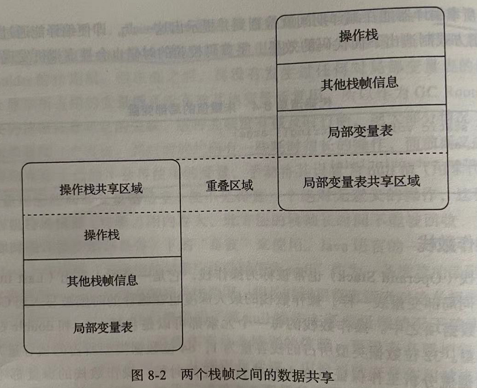

> 补：
>
> 1、类加载
>
> * 数组类：数组类本身不通过类加载器创建，它是由Java虚拟机直接在内存中动态构造出来的。但数组类的元素类型最终还是要考类加载器来完成加载
>
>   * 如果数组的组件类型是引用类型，那就递归采用定义类加载过程去加载。数组C将被标识在加载该组件类型的类加载器的名称空间上。
>   * 如果数组的组件类型不是引用类型，Java虚拟机会把数组C标记为引导类加载器关联
>   * 数组的可访问性与它的组件类型的可访问性一致，如果组件类型不是引用类型，它的数组类可访问性将默认设为public，可被所有类和接口访问到
>
>   加载阶段结束之后，Java虚拟机外部的二进制数据流就按照虚拟机所设定的格式存储在方法区之中了，方法区中的数据结构完全由虚拟机实现自行定义。类型数据妥善安置在方法区之后，会在Java堆内存实例化一个Java.lang.Class对象，这个对象将作为程序访问方法区中的类型数据接口。

静态变量：在类的准备阶段进行初始化零值，在初始化阶段进行赋值 `public static int value = 100`

静态常量：在类的编译的时候就已经赋值了 `public static final int value = 123`

### 运行时栈帧结构

#### 1、局部变量表

局部变量表是一组变量值的存储空间，用于存放**方法参数**和**方法内部定义的局部变量**。在Java程序被编译为Class文件时，就在方法的Code属性的max_locals数据项中确定了该方法所需分配的局部变量表的最大容量。

局部变量表的容量以变量槽为最小单位。

由于局部变量表是建立在线程堆栈中的属于线程私有的数据，无论读写两个连续的变量槽是否为原子操作，都不会引起数据竞争和线程安全问题。

#### 2、操作数栈

操作数栈，是一个先入后出栈。同局部变量表一样，操作数栈的最大深度也在编译的时候被写入到Code属性max_stacks数据项中。

在概念模型中，两个不同栈帧作为不同方法的虚拟机栈的元素，是完全独立的。但是在绝大多数虚拟机实现里都会进行一些优化处理，令两个栈帧部分重叠：好处：节约一些空间，在进行方法调用的时候就可以直接公用一部分数据，无需进行额外的参数复制传递了。



#### 3、动态连接

每个栈帧都包含一个指向运行时常量池中该栈帧所属方法的引用，持有这个引用是为了支持方法调用过程中的动态连接。

Class文件的常量池中存在有大量的符号引用，字节码的方法调用指令就以常量池里指向方法的符号作为参数。这些符号引用一部分在类加载阶段或者第一次使用的时候被转化为直接引用，这种转化叫做静态解析。另一部分将在每一次运行期间都转化为直接引用。这部分就称为动态连接。

#### 4、返回地址

**正常调用完成：**执行引擎遇到任意一个方法返回的字节码指令，这时候可能会有返回值传递给上层的方法调用者，方法是否有返回值以及返回值类型将根据遇到何种方法返回指令来决定。

**异常调用完成：**方法执行的过程中出现了异常，并且这个异常没有在方法体内得到妥善处理。

无论采取何种退出方式，方法退出后，都必须返回到最初方法调用的位置，程序才能继续执行，方法返回时可能需要在栈帧中保存一些信息，来恢复它上层的工作状态。

#### 5、附加信息

与调试、性能相关的信息。

### 方法调用

方法调用并不等同于方法中的代码被执行，方法调用阶段唯一的任务就是确定被调用方法的版本，暂时还未涉及方法内部的具体运行过程

#### 1、解析

调用目标在程序代码写好，编译器进行编译那一刻就已经确定下来。这类方法的调用被称为解析。

**非虚方法：**在**类加载**的时候就可以把符号引用解析为该方法的直接引用。如下表中的五种

| 方法              | 作用                                                         |
| ----------------- | ------------------------------------------------------------ |
| `invokestatic`    | 调用**静态方法**                                             |
| `invokespecial`   | 调用**实例构造器**<init>()方法、**私有方法和父类中的方法**   |
| `invokevirtual`   | 调用所有的虚方法                                             |
| `invokeinterface` | 调用接口方法                                                 |
| `invokedynamic`   | 在运行时动态解析出调用点限定符所引用的方法，然后再执行该方法 |

解析调用是一个静态的过程，在编译期间完全确定，在类的加载的解析阶段就会把涉及的符号引用全部转变为明确的直接引用。

#### 2、分派

##### 2.1、静态分派（重载）

发生在编译阶段：虚拟机在重载时是通过参数的静态类型而不是实际类型作为判断依据的。


##### 2.2、动态分派（重写）

运行期根据实际类型确定方法执行版本的分派过程称为动态分派。


关键在于`invokevirtual`指令执行步骤：

* 找到操作数栈顶的第一个元素所指向的对象的**实际类型**，记作C
* 如果在类型C中找到与常量中的描述符和简单名称都相符的方法，则进行访问权限校验，如果通过则返回这个方法的直接引用，查找过程结束；不通过则返回java.lang.IllegalAccessError异常
* 否则。按照继承关系从上往下依次对C的各个父类进行第二步的搜索和验证过程
* 如果始终没有找到合适的方法，则抛出java.lang.AbstractMethodError异常

> 因为invokevirtual指令执行的第一步就是在运行期确定接收者的实际类型，所以两次调用中的invokevirtual指令并不是把常量池中的符号引用解析到直接引用上就结束了，还会根据方法接收者的实际类型来选择方法版本，这个就是方法重写的本质。

**注意：字段没有多态性**

哪个类的方法访问某个名字的字段是，该名字就是这个类能看到的字段。当子类声明了与父类同名的字段，虽然在子类内存中两个字段都会存在，但是子类的字段回遮蔽父类的同名字段。

```java
/**
 * TODO
 *
 * @author 13540
 * @version 1.0
 * @date 2021-06-13 18:03
 */
public class FieldHashNoPolymorphic {
    static class Father {
        public int money = 1;
        public Father() {
            money = 2;
            showMeTheMoney();
        }
        public void showMeTheMoney() {
            System.out.println("Father: i have $ " + money);
        }
    }
    static class Son extends Father{
        public int money = 3;
        public Son() {
            money = 4;
            showMeTheMoney();
        }
        public void showMeTheMoney() {
            System.out.println("Father: i have $ " + money);
        }
    }
    public static void main(String[] args) {
        Father guy = new Son();
        System.out.println("This guy has $ " + guy.money);
		
    }

}
```

输出：

```bash
Son: i have $ 0
Son: i have $ 4
This guy has $ 2
```

解释：

输出的两句都是“Son”这是因为Son类创建的时候，首先隐式调用了Father的构造函数，而Father构造函数中对showMeTheMoney()的调用是一次虚方法调用，实际执行的版本是Son::showMeTheMoney()方法，所以输出的是Son，而这时候的父类的money已经被初始化了，但是Son::showMeTheMoney()方法中访问的却是子类的money字段，这时候结果自然是0，后面输出子类的就是4，最后一句静态类型访到了父类的money

##### 2.3、单分派与多分派

方法的接收者与方法的参数统称为方法的宗量。根据分派基于多少宗量，可以将分派划分为单分派和多分派。单分派是根据一个宗量对目标方法进行选择，多分派则是根据多于一个宗量对目标方法进行选择。

```java
/**
 * TODO
 *
 * @author 13540
 * @version 1.0
 * @date 2021-06-14 9:49
 */
public class Dispath {
    static class QQ {}
    static class _360 {}
    public static class Father {
        public void hardChoice(QQ arg) {
            System.out.println("father choose QQ");
        }
        public void hardChoice(_360 arg) {
            System.out.println("father choose 360");
        }
    }
    public static class Son extends Father {
        @Override
        public void hardChoice(QQ arg) {
            System.out.println("son choose QQ");
        }

        @Override
        public void hardChoice(_360 arg) {
            System.out.println("son choose 360");
        }
    }

    public static void main(String[] args) {
        Father father = new Father();
        Father son = new Son();
        father.hardChoice(new _360());
        son.hardChoice(new QQ());
    }
}
```

```bash
father choose 360
son choose QQ
```

分析：

* 编译阶段中编译器的选择过程，也就是静态分派过程

  这时候选择目标方法的依据有两点：一是静态类型是Father还是Son，二是方法的参数是QQ还是360.这次选择结果的最终产物是产生了两条invokevirtual指令，两条指令的参数分别为常量池中指向Father::hardChoice(360)及Father::hardChoice(QQ)方法的符号引用。因为是根据两个宗量选择，所以Java语言的静态分派属于多分派类型。

* 运行阶段

  运行阶段，唯一可以影响虚拟机选择的因素只有该方法的接受者的实际类型是Father还是Son。因为只有一个宗量做选择，所以Java语言的动态分派属于单分派类型。

Java语言是一门。静态多分派，动态多分派的语言。

##### 2.4、虚拟机动态分派的实现

动态分派是执行非常频繁的动作，而且动态分派的方法版本选择过程需要在接收者类型的方法元数据中搜索合适的目标方法，消耗性能。因此提出了一种常见的优化手段，为类型在方法区中建立一个虚方法表，与此对应的，在invokeinterface执行时也会用到接口方法表，使用虚方法表索引来代替元数据查找以提高性能。


虚方法表中存放各个方法的实际入口地址。如果某个方法在子类中没有被重写，那子类的虚方法表中的地址入口和父类相同方法的地址入口是一致的，都指向父类的实现入口。如果子类中重写了这个方法，子类虚方法表中的地址都会被替换为指向子类实现版本的入口地址。

#### 3、动态类型语言支持

动态类型语言：动态类型语言的关键特征是它的**类型检查的主体过程**是在**运行期**而不是在编译器进行的。

